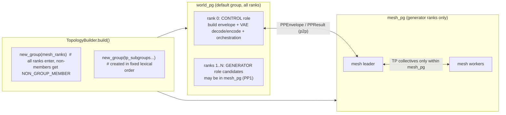

# Phase‑1 instrumentation for raising max pixels at sustained ≥20 FPS

## Executive summary

You have a coherent Phase‑1 plan, and it is directly aligned to raising maximum pixels at a sustained FPS floor:

- **TopologyBuilder (centralized, deterministic `new_group` creation)** is the correctness prerequisite for any future nested hierarchy (world/control/mesh plus TP subgroups). This is not optional because PyTorch requires that *all ranks in the main group enter `new_group()` and do so in the same order*; it also warns that multi‑group NCCL usage requires globally consistent collective ordering.
- **Debug‑only collective visibility via control‑plane boundary event traces** is the cheapest high‑leverage guardrail. It provides "ordering visibility" without requiring a heavy schedule‑manifest DSL, matching the reference library's emphasis that deadlocks "almost always stem from mismatched collective ordering" and mistaken group usage.
- **An integrated runtime report** (p50/p90/p99 chunk time, KV/cache bytes, allocator allocated vs reserved plus fragmentation proxies, and a geometry sweep harness) is the fastest path to turning resolution scaling into a systematic experiment rather than trial‑and‑measure. Your production code already exposes CUDA allocator stats in a debug endpoint, so Phase‑1 can build on that rather than invent new plumbing.

Two calibrations from you change how the measurement plan should be written:

- Baseline resolution is low (typically **~320×576 / ~352×576**), so the right reporting unit is **area multiplier**, not "1024p." Your pipeline enforces `scale_factor=16` (VAE downsample 8× patch embedding stride 2), implying **tokens per frame ≈ (H/16)×(W/16)** for geometry‑only sweeps.
- The "never reference `dist.group.WORLD` anywhere" rule is a worthwhile *later* refactor, but it is larger than Phase‑1 needs. The Phase‑1 invariant can be: subgroup creation order is centralized and deterministic, and group handles are passed explicitly where needed. This matches PyTorch's requirements without forcing a wholesale re‑plumb.

## Repo audit focused on Phase‑1 instrumentation

### Repo boundaries and how they support Phase‑1

The reference library repo is already structured as a curated set of load‑bearing topic cards and links for building distributed inference systems.

It includes a dedicated "Implementation Context" document that maps measured Scope findings to which cards are load‑bearing. That document explicitly frames the system's milestones and attributes the TP=2 compile unlock to switching collectives to functional form.

The production repo contains the Krea realtime pipeline and already enforces resolution invariants and compile modes. It also already exposes allocator stats (`memory_allocated`, `memory_reserved`, peaks) via a debug info method, which is exactly the data you want to surface in the runtime report.

### Inventory table scoped to Phase‑1 (not an exhaustive tree)

| Area | Repo | Concrete file evidence | Why it matters for Phase‑1 |
|---|---|---|---|
| Resolution invariants, scale factor | `scope-drd` | Krea pipeline validates `scale_factor=16` via `validate_resolution(height,width,scale_factor=16)` | Enables clean geometry‑only sweeps where tokens/frame scales predictably with area. |
| Compile modes and CUDA graph constraints | `scope-drd` | Krea pipeline has configurable compile strategy and explicitly warns that `mode="reduce-overhead"` (CUDA graph trees) is unstable on SM103 unless forced. | Your sweep harness must pin compile settings to avoid "changed graph strategy" confounds. |
| Warmup designed to lock steady‑state KV cache behavior | `scope-drd` | Warmup runs enough iterations to fill KV cache completely so compile occurs at steady‑state cache size and avoids recompilation mid‑stream. | Geometry sweeps must not accidentally move the system into a "recompile storm" regime. |
| Allocator metrics already available | `scope-drd` | `PipelineManager.get_debug_info()` returns current and max `memory_allocated()` and `memory_reserved()` when CUDA is available. | Phase‑1 report can ship quickly by reusing this hook and adding a few more `memory_stats()` fields. |
| Formal backpressure target (queue depths and overlap score) | `learn-distrib-dit` | PP overlap design calls for bounded queues `D_in=2`, `D_out=2`, pass gate `OverlapScore ≥ 0.30`. | This drives how you should structure PP boundary tracing and report "overlap achieved" later, but even in Phase‑1 it motivates queue discipline and tail latency tracking. |
| Why collectives need functional form under compile | `learn-distrib-dit` | Topic 11 states: in‑place collectives cause graph breaks, functional collectives return new tensors and become traceable; it cites the measured 9.6→24.5 FPS jump. | This motivates tracing boundaries around "collective wrappers" and reporting graph break indicators where possible. |
| Bandwidth accounting lens | `learn-distrib-dit` | Topic 18 frames bandwidth accounting and records the bandwidth scaling observation across GPU tiers and a concrete all‑reduce measurement. | Even if you do not measure true TB/s in Phase‑1, you can treat time‑vs‑area slope as the first diagnostic and defer TB/s to an nsys/ncu follow‑up. |
| Overlap measurement caveat | `scope-drd` | The multi‑GPU scaling note warns the block profiler uses per‑block CUDA synchronize, which prevents async overlap and recommends nsys or overlap‑aware timing for overlap experiments. | Your Phase‑1 sweep must avoid per‑block synchronizes when measuring end‑to‑end chunk time. |

## Architecture mapping for Phase‑1 and what it must guarantee

### What Phase‑1 needs (and what it can defer)

Phase‑1 is about making resolution sweeps systematic, while laying correctness groundwork for PP bringup later:

- **Must guarantee now**: deterministic subgroup creation and deterministic ordering visibility at control‑plane boundaries.
- **Can defer**: a deep refactor that eliminates all use of implicit world accessors (`dist.group.WORLD`, `dist.get_world_size()`) across the entire codebase. Your Phase‑1 invariant can be narrower: "TopologyBuilder is the only site of `new_group`, and the returned group handles are passed explicitly where needed."

### Mermaid diagram of the intended topology shape

This diagram expresses exactly the constraints PyTorch documents: `new_group` must be entered by all ranks and group creation must be ordered identically across ranks.

### Visual grounding for the "slope can go superlinear" nuance

One key nuance you raised is correct: self‑attention has **quadratic** time and memory complexity in sequence length in the general case, and FlashAttention reduces memory traffic by being IO‑aware but does not eliminate the quadratic nature of the attention computation itself.

## Phase‑1 implementation plan mapped to your existing code and docs

### TopologyBuilder as the sole `new_group` site

PyTorch is explicit: `torch.distributed.new_group()` requires all processes in the main group to enter the call even if they will not be members, and groups should be created in the same order across processes. It also warns that multi‑group NCCL use requires a globally consistent execution order (and additional stream synchronization when switching between groups after async ops).

A Phase‑1‑sized pattern that satisfies this without a huge refactor:

- Create a `Topology` dataclass that stores:
  - rank, world size
  - world_pg (optional, but can be implied)
  - mesh ranks (even if PP is disabled)
  - group handles (some may be `NON_GROUP_MEMBER`)
- Create a single `TopologyBuilder.build()` that:
  - reads configuration (PP enabled, TP degree)
  - computes the rank lists
  - executes all `new_group()` calls in a fixed lexical order
  - returns the immutable `Topology`

Important: Phase‑1 does not require removing all `dist.get_world_size()` usage. It requires that **subgroup creation** and **group handle ownership** are centralized and deterministic.

### Debug ordering trace at control‑plane boundaries

Your target is "ordering visibility" without a heavy manifest. The reference library's deadlock section explicitly frames deadlocks as mismatched collective ordering or wrong process group usage.

A Phase‑1 implementation that stays control‑plane only:

- Define a debug tracer that records a sequence of small "event IDs" at the boundaries where your code calls:
  - TP broadcast wrappers
  - TP all‑reduce wrappers (both eager in‑place and compile funcol paths)
  - PP send/recv wrappers
- At end‑of‑chunk (a point all ranks should reach), do:
  - `all_gather` of a fixed‑width hash of the event stream (fast path)
  - if mismatch, `all_gather_object` of the last K events for a human diff

This matches the "bounded queue" and "cache_epoch / call_id monotonicity" philosophy in the idempotency/backpressure cards: correctness via explicit metadata and deterministic stage coordination.

### Integrated runtime report: what to emit and where to hook it

You already have two crucial ingredients:

- Krea pipeline keeps key state in a pipeline `state` (height, width, cache management, KV‑cache attention bias).
- PipelineManager already exposes allocator metrics (allocated/reserved and peaks).

Phase‑1 report should emit three types of data per resolution point:

**Latency distribution**
- chunk time p50/p90/p99 for a fixed steady‑state window (e.g. last 128 chunks)
- optionally first‑chunk time after warmup separately, since compile mode may re‑warm and skew tails

**Geometry and token accounting**
- (H, W), area, area_multiplier relative to baseline
- tokens_per_frame = (H/16)×(W/16), justified by `scale_factor=16` validation
- fixed temporal parameters for the sweep (steps list, `num_frame_per_block`, `local_attn_size`, `kv_cache_num_frames`) as metadata so you can verify sweep purity

**Allocator and cache proxies**
- allocated vs reserved, and peaks (already in PipelineManager debug info)
- PyTorch allocator statistics via `torch.cuda.memory.memory_stats()`, which provides reserved bytes, allocated bytes, segments, active bytes, and related counters — useful for fragmentation proxies
- a "fragmentation-ish" scalar like:
  - `slack = reserved_bytes.current - active_bytes.current`
  - plus `segment.*.current` counts to detect allocator segment growth
- KV/cache bytes:
  - if you can directly introspect KV tensors, report exact `sum(t.nbytes)`
  - if not, report a lower‑fidelity proxy derived from geometry and fixed temporal window, ensuring it scales linearly with area under fixed temporal settings (this is still useful for slope comparison)

Important: the PyTorch memory profiler does not see non‑PyTorch allocations; NCCL is a common example of GPU memory that can be invisible to PyTorch's allocator tracking. So allocator metrics are necessary but not sufficient to declare "no memory issue."

## Geometry‑only sweeps and the slope test

### Sweep definition

You proposed the correct "Phase‑1 scaling law" experiment:

Hold fixed:
- denoising step list (e.g. default `[1000, 750, 500, 250]`)
- fixed chunking and fixed temporal windowing policy
- fixed VAE behavior and prompt path
- fixed compile configuration

Vary only:
- height, width (multiples of 16), to target +10%, +20%, +50% area multipliers

This directly leverages the pipeline's explicit resolution validation and allows a clean mapping from geometry to token count per frame.

### Token scaling and why KV bytes should be near‑linear in area in this sweep

Because the spatial stride is fixed by `scale_factor=16`, tokens_per_frame scales approximately as:

$$S(H,W) \approx (H/16) \cdot (W/16)$$

So under a fixed temporal cache window, KV residency and KV read/write bytes scale approximately linearly with area (via S). This is exactly the kind of "first‑principles slope" reasoning the bandwidth accounting card is pushing.

### Your nuance is correct: slope can go superlinear and that does not automatically imply "not bandwidth‑bound"

Standard self‑attention's time and memory complexity are quadratic in sequence length in general. FlashAttention focuses on IO‑aware tiling to reduce HBM round‑trips (lower memory traffic than naive attention), but it does not remove the fundamental scaling pressures of attention as sequence length grows.

So your runtime report should explicitly treat "superlinear chunk time vs area" as a triage trigger:

- If chunk time grows roughly linearly with area and KV bytes grow linearly with area, your first hypothesis is "memory traffic dominates," but you still validate with deeper profiling later.
- If chunk time grows superlinearly with area while KV bytes remain linear, attention compute scaling is a plausible culprit, especially if increasing tokens increases the effective sequence lengths seen by attention kernels. FlashAttention‑2 explicitly states that attention runtime and memory increase quadratically with sequence length and discusses why kernel efficiency depends on work partitioning and occupancy.
- If chunk time grows superlinearly and allocator slack and segment counts also worsen, allocator churn and fragmentation become plausible — use PyTorch allocator stats and possibly snapshots to confirm.

### Avoiding measurement traps

Your multi‑GPU scaling note is explicit: the block profiler uses per‑block CUDA synchronization, which prevents async overlap and will distort any attempt to infer concurrency from block‑level timings.

Therefore, for geometry sweeps you should measure:
- end‑to‑end chunk wall time with minimal synchronization
- compute percentiles over steady‑state iterations

Then, only if needed, introduce `nsys` or `ncu` for "compute vs bandwidth" disambiguation in a second step. This matches your calibration that true sustained HBM TB/s measurement can be deferred.

## Risks and mitigations most relevant to Phase‑1

### Multi‑group deadlocks and subgroup creation drift

**Risk:** subgroup creation drift across ranks (different order or different conditionally created groups) can hang the job.

**Mitigation:** TopologyBuilder as the only `new_group` site, deterministic group‑creation order, and debug ordering traces at control‑plane boundaries. This is directly grounded in PyTorch's `new_group` contract and warnings about multi‑group usage.

### Compile strategy confounds in resolution sweeps

**Risk:** changing compile configurations between resolutions turns a geometry experiment into a "graph strategy" experiment.

**Evidence:** Krea pipeline supports multiple compile strategies and modes, and the comments emphasize the fragility of some CUDA graph paths on certain devices.

**Mitigation:** pin compile mode and compile strategy for the sweep, log them in the report metadata each run.

### Allocator measurement blind spots

**Risk:** allocator metrics show "stable," but performance collapses due to non‑PyTorch allocations or other GPU memory effects.

**Evidence:** PyTorch's memory snapshot tooling only sees allocations managed through the PyTorch allocator; NCCL allocations are a common invisible source.

**Mitigation:** report allocator metrics anyway (still essential), but treat them as partial diagnostic, and escalate to nsys/ncu only when slope tests indicate something non‑linear or unstable.

## Prioritized learning resources mapped to Phase‑1 gaps

This is scoped to the knowledge you will need to implement Phase‑1 cleanly.

### Process groups and multi‑group correctness

PyTorch's distributed docs around `new_group()` are the primary spec for your TopologyBuilder invariant, including: "all processes in the main group must enter this function," "groups should be created in the same order," and the warning about consistent ordering of collectives when using multiple process groups with NCCL.

### Allocator metrics and memory debugging

The `torch.cuda.memory.memory_stats()` API documents which counters exist (allocated bytes, reserved bytes, active bytes, segments) and is the right way to build "fragmentation-ish" proxies into your runtime report.

The "Understanding CUDA Memory Usage" guide provides the mental model for snapshots and explicitly warns about non‑PyTorch allocations.

### Compile and CUDA graph interactions

Your pipeline already treats some CUDA graph paths as risky on certain devices. PyTorch docs confirm that `mode="reduce-overhead"` uses CUDA graph trees and describe the associated behaviors and footguns.

### Attention scaling and why slope can turn superlinear

FlashAttention's paper states that self‑attention time and memory complexity are quadratic in sequence length and motivates IO‑aware tiling between HBM and SRAM.

FlashAttention‑2 reiterates quadratic scaling and frames attention as the bottleneck for scaling to longer sequences, then focuses on work partitioning and occupancy.

## Phase‑1 next actions and a short checklist

### Concrete next actions

- Implement `TopologyBuilder.build()` that is the only `new_group` call site and returns an immutable `Topology`. Validate determinism by logging a "group creation transcript" per rank during bringup.
- Add debug‑only distributed boundary wrappers that emit event IDs and build a per‑chunk trace fingerprint; all_gather the fingerprint at end‑of‑chunk and assert equality.
- Add a geometry sweep harness that varies only (H,W) and emits a standardized report JSON per run: default step list, fixed temporal settings, chunk time percentiles, KV/cache proxy, allocator metrics.

### Phase‑1 checklist for a clean +20% area experiment

- Configuration hygiene
  - Confirm `scale_factor=16` validation remains unchanged across runs.
  - Pin compile flags and compile strategy, log them in the report.
  - Keep denoising step list fixed across runs.
- Measurement hygiene
  - Exclude warmup iterations (KV cache fill and compile warmup) from the percentile computation.
  - Measure chunk wall time without per‑block synchronizes; avoid the overlap‑killing profiler mode for this measurement.
- Report contents
  - Emit p50/p90/p99 chunk time vs area multiplier.
  - Emit tokens/frame vs area multiplier (derived from H,W and `scale_factor=16`).
  - Emit allocator allocated vs reserved plus at least one `memory_stats()`‑derived slack scalar.
  - Emit KV/cache bytes if directly introspectable, else emit a proxy and label it as proxy.
- Triage rules
  - If chunk time slope becomes superlinear, escalate to deeper profiling to separate attention compute scaling from allocator pathologies.
